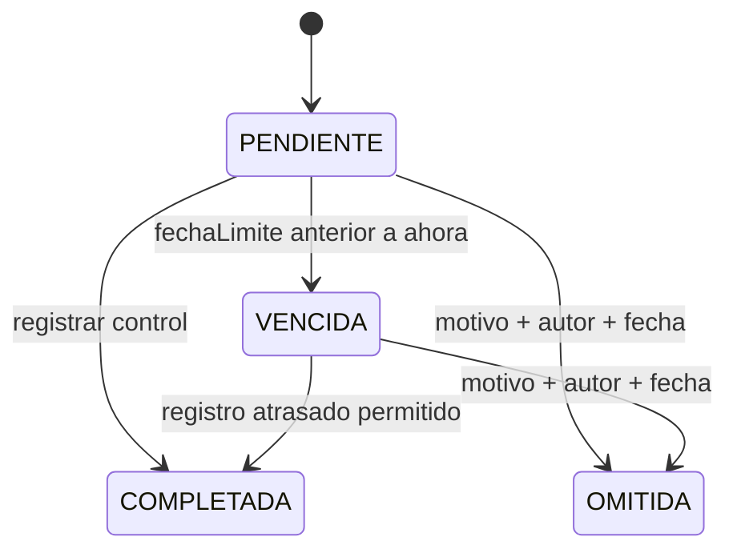

# Ciclo operativo de tareas

Implementado sobre `main` / `29f4228`. Symfony 7.4, API Platform 4.3 y PostgreSQL real.

## Definición y ejecución

`TareaAPPCC` define el control: frecuencia, hora local, día semanal o mensual, plazo, límites e instrucciones. `TareaProgramada` es una ejecución de esa definición con fecha, límite opcional, asignación y estado. `RegistroAPPCC` es el resultado único de una ejecución completada.

La recurrencia existente permanece en `GeneradorTareasProgramadasService` y `CalendarioAPPCC`: diaria; semanal según día ISO 1–7; mensual ajustada al último día válido cuando el configurado no existe. Se conserva el tratamiento de horas inexistentes o repetidas durante cambios estacionales, la exclusión de ocurrencias anteriores a `createdAt` y los plazos medidos en minutos transcurridos. Las fechas se calculan en la zona fiscal y se guardan siguiendo la estrategia UTC actual (`TIMESTAMP WITHOUT TIME ZONE`, PHP configurado en UTC). La fecha de creación de la definición utiliza ahora el mismo reloj sustituible que los servicios.

Los cambios de calendario siguen pasando por `TareaAPPCCService`: retiran futuras pendientes sin registro para que el siguiente ciclo regenere el horizonte. Se conservan las históricas, completadas, omitidas y las que ya tienen registro. La versión optimista de la definición y sus bloqueos permanecen activos.

## Comando y cron

```bash
php bin/console app:tareas:procesar
php bin/console app:tareas:procesar --horizonte-dias=7 --json
php bin/console app:tareas:procesar --desde=2026-09-01 --hasta=2026-09-14
php bin/console app:tareas:procesar --desde=2026-09-14T00:00:00Z --hasta=2026-09-15T00:00:00Z
```

`CicloOperativoTareasService` primero genera y después detecta vencimientos en **todos los establecimientos y entidades fiscales activos**, sin JWT, cabecera ni petición HTTP. No puede invocarse desde una petición API ni dentro de una transacción exterior. No necesita Messenger ni Scheduler.

Sin límites explícitos, cada zona fiscal utiliza desde las 00:00 de **ayer** hasta las 23:59:59 del día local actual más el horizonte (7 días por defecto; intervalo admitido 1–366). Así se recuperan las ejecuciones de ayer y de hoy aunque el cron se haya detenido antes de generarlas. El horizonte 7 abarca nueve fechas locales contando ambos extremos. Para una caída más larga, ejecutar una recuperación con `--desde` y `--hasta`; no existe un cursor persistente de la última ejecución del cron.

Las fechas `YYYY-MM-DD` incluyen días completos en cada zona fiscal. Los instantes ISO requieren segundos y zona explícita. No se mezclan ambos formatos. Con un único extremo, el otro se obtiene sumando/restando el horizonte a ese extremo. Los valores vacíos de las opciones se tratan como ausentes. Se rechazan fechas relativas, fechas inexistentes, intervalos invertidos y horizontes no enteros.

Cron recomendado, sustituyendo la ruta por la instalación real:

```cron
*/5 * * * * cd /srv/appcc/backend && APP_ENV=prod /usr/bin/php bin/console app:tareas:procesar --horizonte-dias=7 --json >> /var/log/appcc-tareas.log 2>&1
```

Configurar la rotación del log y supervisar el código de salida. No es necesario bloquear el comando con `flock`: los bloqueos PostgreSQL y la unicidad permiten dos procesos concurrentes. Código **0**: procesado correctamente; **1**: errores operativos; **2**: opciones inválidas. Las definiciones heredadas incompletas se notifican como ignoradas y deben configurarse.

El resumen incluye `tareasAnalizadas`, `creadas`, `existentes`, `ignoradas`, `vencidas`, `ignoradasDetalle` y `errores`. Cada error identifica fase, tarea, establecimiento, clase y mensaje. Los contadores de generación solo se incorporan tras confirmar la transacción. El comando anterior `app:tareas:generar` sigue disponible con su comportamiento y sus opciones anteriores; únicamente genera, sin vencer tareas.

## Endpoints

En todas las peticiones API:

```http
Authorization: Bearer <JWT>
X-Establecimiento-Id: 1
Content-Type: application/ld+json
Accept: application/ld+json
```

Los valores de los enum en JSON son minúsculas: `bajo_demanda`, `pendiente`, `vencida`, `completada`, `omitida`.

### Crear manualmente

```http
POST /api/tareas/12/programaciones
```

```json
{
  "fechaProgramada": "2026-09-14T10:00:00+02:00",
  "fechaLimite": "2026-09-14T11:00:00+02:00",
  "asignadoA": "/api/usuarios/3"
}
```

Devuelve **201** con la ejecución y su IRI `/api/tareas-programadas/{id}`. Solo admite `BAJO_DEMANDA`, con tarea, plan y contexto activos. `fechaLimite` y `asignadoA` pueden omitirse o ser `null`. El límite debe ser igual o posterior a la programación. Las fechas admiten precisión de segundos; se exige zona explícita y se normalizan antes de persistir. Si se asigna, el usuario y su membresía en el establecimiento deben estar activos.

Política idempotente manual: la clave es **tarea + instante programado**, normalizado a segundos. Repetirla devuelve **409**, incluso si cambian el límite o el usuario del JSON. Nunca sobrescribe la ejecución existente ni expone un error UNIQUE sin tratar. Tras un reintento conflictivo, consultar la agenda por tarea y fecha. La generación recurrente, en cambio, devuelve internamente la existente y la contabiliza.

### Asignar o desasignar

```http
POST /api/tareas-programadas/25/asignar
```

```json
{"usuario": "/api/usuarios/3"}
```

```json
{"usuario": null}
```

Devuelve **200**. Se exige la propiedad `usuario`; `null` desasigna. Solo admite ejecuciones pendientes o vencidas. La pertenencia y actividad del destinatario se comprueban bajo bloqueo compartido sobre usuario y membresía.

### Omitir con auditoría

```http
POST /api/tareas-programadas/25/omitir
```

```json
{"motivo": "El establecimiento permaneció cerrado."}
```

Devuelve **200** con `estado: "omitida"`, `motivoOmision`, `omitidaAt` y `omitidaPor`. Recorta el motivo y exige entre 3 y 2000 caracteres. El servicio obtiene el autor del usuario autenticado y la fecha del reloj del servidor. Enviar esos campos o `estado` en el JSON no permite modificarlos: el DTO solo consume el motivo. Tampoco existe un PATCH genérico de ejecuciones.

## Agenda, filtros y paginación

`GET /api/tareas-programadas` incluye todos los estados del establecimiento seleccionado. `GET /api/tareas-programadas/agenda` limita además a pendientes y vencidas, incluidas las futuras dentro de los filtros solicitados. Un filtro explícito de estado en esta última ruta se intersecta con esa restricción.

| Parámetro | Ejemplo / efecto |
| --- | --- |
| `estado` | `pendiente`; también admite `estado[]=pendiente&estado[]=vencida` |
| `fechaProgramada[after]` | Límite inferior inclusivo |
| `fechaProgramada[before]` | Límite superior inclusivo |
| `fechaLimite[before]` | Límite superior inclusivo; excluye las filas sin fecha límite |
| `asignadoA` | IRI `/api/usuarios/3` |
| `tarea` | IRI `/api/tareas/12` |
| `order[fechaProgramada]` | `asc` o `desc`; desempate por `id ASC` |
| `page` | Página, desde 1 |
| `itemsPerPage` | 30 por defecto; máximo 100 |

Las fechas de filtro aceptan un instante ISO con zona o un día `YYYY-MM-DD` a las 00:00 UTC. Un `before` con fecha sin hora no representa el día completo. Para incluir un día completo, enviar un límite horario explícito. Codificar el `+` del offset como `%2B` en la URL.

```text
GET /api/tareas-programadas?estado=pendiente&fechaProgramada[after]=2026-09-14T00:00:00Z&fechaProgramada[before]=2026-09-14T23:59:59Z&order[fechaProgramada]=asc&itemsPerPage=20&page=1
```

Se usan las APIs `QueryParameter`, `ExactFilter`, `IriFilter` y `SortFilter` verificadas en la versión instalada, conforme a la [documentación de filtros de API Platform](https://api-platform.com/docs/core/doctrine-filters/). El filtro de fechas convierte el offset a la zona de persistencia antes de comparar en SQL. La extensión de tenant actúa en SQL antes de ordenar y paginar; las IRI ajenas nunca amplían el ámbito. La respuesta JSON-LD conserva `member`, `totalItems` y los enlaces de paginación.

## Vencimiento y estados

Solo vence una ejecución **PENDIENTE** con `fechaLimite < ahora`. La igualdad no vence todavía. Sin fecha límite permanece pendiente hasta que se registre u omita; no se inventa un vencimiento al finalizar el día. La detección no modifica completadas u omitidas, ni depende de que la definición siga activa: revisa todas las pendientes de establecimientos y entidades fiscales activos.



COMPLETADA y OMITIDA son estados definitivos. No se permite reabrir, reasignar ni volver a omitir una ejecución cerrada. Registrar una omitida devuelve 422. Las reglas existentes de registros atrasados siguen decidiendo si una vencida puede completarse.

## Permisos y errores

| Operación | ADMIN | RESPONSABLE | TRABAJADOR | AUDITOR |
| --- | --- | --- | --- | --- |
| Consultar agenda | Sí | Sí | Sí | Sí |
| Crear BAJO_DEMANDA | Sí | Sí | No | No |
| Asignar / desasignar | Sí | Sí | No | No |
| Omitir | Sí | Sí | No | No |
| Registrar controles | Sí | Sí | Sí | No |

Son roles de la membresía activa en el establecimiento seleccionado. `TenantAuthorization` centraliza la autorización y el servicio de dominio vuelve a comprobar el recurso y sus reglas. Sin JWT: **401**; cabecera ausente o inválida: **400**; sin membresía activa o rol suficiente: **403**; recurso de otro establecimiento: **404**; regla de negocio incumplida: **422**; duplicidad, versión obsoleta o conflicto de bloqueo recuperable mediante reintento: **409**.

## Transacciones y concurrencia

Cada definición se genera en una transacción independiente. Un fallo revierte toda su ventana, descarta el EntityManager invalidado y permite continuar con las demás tareas y establecimientos. La consulta de definiciones reutiliza la selección existente y pagina IDs en lotes de 100; no hidrata todas las tareas del sistema.

Crear una programación toma el mismo bloqueo pesimista sobre la definición que la generación y reconciliación; se mantiene `UNIQUE (tarea_id, fecha_programada)` como última protección. El contexto activo y su zona fiscal se recargan bajo los bloqueos existentes. Las modificaciones obsoletas de la definición siguen comprobando su versión.

Asignar, omitir, registrar y vencer comparten el bloqueo de fila de la ejecución. Se recarga después de esperar para evaluar el estado confirmado por el proceso anterior. Dos asignaciones válidas se serializan; la última confirmada determina el usuario. No se añade una versión de cliente a la ejecución. Los deadlocks, fallos de serialización, UNIQUE y conflictos optimistas se traducen a 409 mediante `TransaccionAPPCC`.

La detección utiliza una actualización SQL condicional con lotes de 100 y `FOR UPDATE`, ordenados por fecha límite e ID. Actualiza también `updated_at` y recarga únicamente los objetos que ya tenía el llamante: no hidrata toda la agenda. El comando confirma cada lote; una invocación del servicio dentro de una transacción exterior respeta su commit/rollback. Un error revierte el lote afectado; los lotes ya confirmados se incluyen en el resumen incluso si falla uno posterior. El siguiente cron reintenta las pendientes.

## Migración e índice

Se añade únicamente `Version20260913100000`; ninguna migración publicada se reescribe. Añade `motivo_omision`, `omitida_at`, `omitida_por_id`, FK `ON DELETE RESTRICT`, su índice de relación y `chk_programada_omision`.

El CHECK exige los tres datos completos para OMITIDA y todos nulos en los demás estados; valida también longitud y recorte del motivo. Se crea `NOT VALID` y se valida automáticamente si los datos existentes lo permiten. Una fila OMITIDA heredada sin auditoría se conserva sin inventar autor, motivo ni fecha; permanece consultable y cerrada. Si existe alguna, el CHECK queda sin validar para el histórico y **se aplica igualmente a todas las nuevas inserciones y actualizaciones**. Solo después de una reparación con datos acreditados puede ejecutarse:

```sql
ALTER TABLE tarea_programada VALIDATE CONSTRAINT chk_programada_omision;
```

La reversión se bloquea si pudiera perder auditoría. `doctrine:schema:validate` verifica el mapping; el estado de validación de los CHECK debe consultarse además en `pg_constraint`.

Se conserva `idx_programada_agenda (establecimiento_id, estado, fecha_programada)` y se añade `idx_programada_vencimiento (establecimiento_id, estado, fecha_limite, id)`. La fecha programada no permite acotar una búsqueda por fecha límite ni satisfacer su orden. `MigracionCicloOperativoTest::testPlanDeConsultaJustificaIndicePorFechaLimite` compara `EXPLAIN (ANALYZE, BUFFERS)` con 20.000 ejecuciones y 20 vencimientos: comprueba que el índice nuevo se utiliza y que, sin él, se filtran las 19.980 restantes. La medición reproducible se escribe en `var/plan-vencimientos.json` durante las pruebas.

## Límites pendientes

`BAJO_DEMANDA` continúa manual. No se implementan `POR_TURNO`, `POR_RECEPCION`, notificaciones, frontend, Messenger ni Scheduler. Las fotografías, el almacenamiento privado y la confirmación auditable se describen en [evidencias y registros](evidencias-registros.md). El cron debe instalarse en el servidor de despliegue. Los cambios de zona fiscal y las escrituras directas que eludan los servicios siguen sin provocar reconciliación automática. Las definiciones heredadas incompletas y las omisiones históricas sin auditoría necesitan una revisión explícita; no se rellenan datos por suposición.

## Pruebas existentes

No se eliminan pruebas ni se reducen aserciones. Dos archivos existentes requieren adaptación: `ReconciliacionTareasTest` crea su omisión con motivo, autor y reloj y solicita `ORDER BY id` al comparar una lista con otra ordenada por ID; `MigrationPlanTest` revierte/reaplica la nueva ampliación al reconstruir la tabla histórica. Conservan todas sus comprobaciones anteriores. El orden explícito evita depender de un plan SQL que cambia al incorporar índices. Los seis fallos iniciales dependientes del día real se corrigen en producción usando el reloj de Symfony para `TareaAPPCC::createdAt`, sin cambiar las fechas esperadas de las pruebas.
