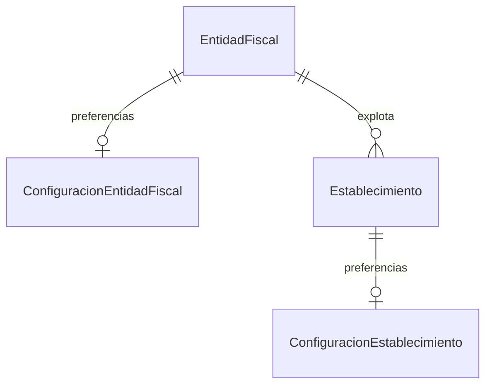

# Configuración del SaaS

Se añaden preferencias de entidad fiscal y establecimiento sobre el modelo APPCC
existente. Se mantienen PHP 8.3.11, Symfony 7.4.18, Doctrine ORM 3.7.0, DBAL 4.4.4
y API Platform 4.3.18. No se instalan dependencias ni se añaden enums.

## Separación de niveles

- SaaS: PlantillaAPPCC y TipoActividad continúan definiendo las configuraciones iniciales.
- Entidad fiscal: idioma, zona horaria, logo y preferencias generales.
- Establecimiento: horarios y preferencias operativas.
- Tarea: límites, frecuencia, unidad e instrucciones, además del JSON existente
  `TareaAPPCC.configuracion`. No se crea ConfiguracionTarea.

Las nuevas preferencias no se aplican aún al comportamiento del sistema: no crean
incidencias, no validan registros atrasados ni exigen observaciones, fotos o firmas.
Tampoco envían avisos, generan trabajos programados o eliminan registros.
`diasConservacionRegistros` es únicamente una preferencia almacenada.

## Archivos

Creados:

- `src/Entity/ConfiguracionEntidadFiscal.php`
- `src/Entity/ConfiguracionEstablecimiento.php`
- `src/Repository/ConfiguracionEntidadFiscalRepository.php`
- `src/Repository/ConfiguracionEstablecimientoRepository.php`
- `migrations/Version20260911151914.php`
- `tests/ConfiguracionTest.php`
- Este documento.

Modificados:

- `src/Entity/EntidadFiscal.php`: relación inversa y getConfiguracion/setConfiguracion.
- `src/Entity/Establecimiento.php`: relación inversa y getConfiguracion/setConfiguracion.
- `tests/EntidadFiscalTest.php`: crea todo el esquema de prueba en memoria para que
  Doctrine pueda hidratar la nueva relación OneToOne.
- `tests/MigrationPlanTest.php`: incorpora la tercera migración al cotejo sin conexión.

No se han cambiado los campos previos, sus reglas ni las migraciones existentes.

## Campos de las tablas

Los valores por defecto de preferencias coinciden en PHP y en las columnas SQL.
Los campos obligatorios tienen NOT NULL en PostgreSQL. createdAt se asigna en PHP;
no utiliza un DEFAULT SQL.

### `configuracion_entidad_fiscal`

| Campo PHP | Columna SQL | Tipo SQL | Nullable | Valor inicial PHP |
| --- | --- | --- | --- | --- |
| id | id | INTEGER, identity, PK | No | null hasta persistir |
| entidadFiscal | entidad_fiscal_id | INTEGER, FK, UNIQUE | No | null hasta asignar titular |
| logoPath | logo_path | VARCHAR(255) | Sí | null |
| idioma | idioma | VARCHAR(10) | No | es |
| zonaHoraria | zona_horaria | VARCHAR(100) | No | Europe/Madrid |
| notificacionesEmail | notificaciones_email | BOOLEAN | No | true |
| notificarIncidencias | notificar_incidencias | BOOLEAN | No | true |
| notificarTareasPendientes | notificar_tareas_pendientes | BOOLEAN | No | true |
| resumenDiarioEmail | resumen_diario_email | BOOLEAN | No | false |
| diasConservacionRegistros | dias_conservacion_registros | INTEGER | Sí | null |
| permitirGestionMultiEstablecimiento | permitir_gestion_multi_establecimiento | BOOLEAN | No | true |
| createdAt | created_at | TIMESTAMP WITHOUT TIME ZONE | No | DateTimeImmutable actual |
| updatedAt | updated_at | TIMESTAMP WITHOUT TIME ZONE | Sí | null |

### `configuracion_establecimiento`

| Campo PHP | Columna SQL | Tipo SQL | Nullable | Valor inicial PHP |
| --- | --- | --- | --- | --- |
| id | id | INTEGER, identity, PK | No | null hasta persistir |
| establecimiento | establecimiento_id | INTEGER, FK, UNIQUE | No | null hasta asignar titular |
| horaInicioJornada | hora_inicio_jornada | TIME WITHOUT TIME ZONE | Sí | null |
| horaFinJornada | hora_fin_jornada | TIME WITHOUT TIME ZONE | Sí | null |
| requiereFirmaRegistro | requiere_firma_registro | BOOLEAN | No | false |
| permiteRegistrosAtrasados | permite_registros_atrasados | BOOLEAN | No | false |
| maximoMinutosRegistroAtrasado | maximo_minutos_registro_atrasado | INTEGER | Sí | null |
| generaIncidenciaAutomatica | genera_incidencia_automatica | BOOLEAN | No | true |
| requiereObservacionNoConforme | requiere_observacion_no_conforme | BOOLEAN | No | true |
| requiereFotoNoConforme | requiere_foto_no_conforme | BOOLEAN | No | false |
| permitirCerrarIncidenciaSinAccion | permitir_cerrar_incidencia_sin_accion | BOOLEAN | No | false |
| avisarTareasPendientes | avisar_tareas_pendientes | BOOLEAN | No | true |
| minutosAvisoTarea | minutos_aviso_tarea | INTEGER | No | 30 |
| createdAt | created_at | TIMESTAMP WITHOUT TIME ZONE | No | DateTimeImmutable actual |
| updatedAt | updated_at | TIMESTAMP WITHOUT TIME ZONE | Sí | null |

## Relaciones, integridad y serialización



Cada titular puede existir sin configuración, pero una configuración debe pertenecer
a un titular. Los setters mantienen ambos lados al asignar, reasignar, sustituir o
desvincular objetos. No se instancia configuración dentro de los constructores de
EntidadFiscal o Establecimiento.

Las configuraciones son el lado propietario, con FK obligatoria y única.
Los padres son el lado inverso. No se usa cascade remove, cascade persist ni
orphanRemoval. Las FK usan ON DELETE RESTRICT. Actualizar o eliminar una
configuración no elimina ni modifica el historial APPCC.

Se recomienda actualizar la configuración existente mediante PATCH. Sustituir una
configuración por otro objeto en PHP deja la anterior temporalmente sin titular;
esa configuración no puede persistirse sin reasignarla o gestionar explícitamente
su retirada. No hay eliminación automática de objetos al desvincularlos.

Se mantiene el patrón existente de ApiProperty: el titular se serializa como IRI
desde la configuración y la propiedad inversa `configuracion` no se lee ni escribe
en los cuerpos API del titular. No se añaden grupos ni se serializan árboles
completos. Los setters inversos siguen disponibles para el código PHP.

Restricciones únicas:

- `UNIQ_4865284CD3FCA8FD` sobre `configuracion_entidad_fiscal(entidad_fiscal_id)`.
- `UNIQ_949EEFF871B61351` sobre `configuracion_establecimiento(establecimiento_id)`.

Además de UNIQUE en la BD, UniqueEntity devuelve errores de validación en español
cuando se intenta crear otra configuración para un titular ya configurado.

## Validaciones y fechas

- logoPath: longitud máxima de 255, opcional; solo almacena la ruta o identificador.
- idioma: NotBlank y longitud máxima de 10; admite futuros idiomas sin enum.
- zonaHoraria: NotBlank, longitud máxima de 100 y
  [Timezone de Symfony](https://symfony.com/doc/7.4/reference/constraints/Timezone.html).
- diasConservacionRegistros: positivo o null.
- maximoMinutosRegistroAtrasado: positivo, cero o null.
- minutosAvisoTarea: positivo o cero.
- No se exige un máximo de retraso cuando se activa la preferencia, ni se elimina
  el máximo guardado al desactivarla. Su interpretación será responsabilidad del
  servicio de registro futuro.
- Las horas usan DateTimeImmutable con Doctrine TIME_IMMUTABLE y el mismo formato
  `HH:mm:ss` de TareaAPPCC. Se permiten horarios nocturnos como 22:00:00–06:00:00.
- createdAt se establece en el constructor y updatedAt mediante PreUpdate.
  Ambos son de solo lectura en la API.

## Endpoints

| Método | Ruta | Uso |
| --- | --- | --- |
| GET | /api/configuraciones-entidad-fiscal | Listar |
| POST | /api/configuraciones-entidad-fiscal | Crear |
| GET | /api/configuraciones-entidad-fiscal/{id} | Consultar |
| PATCH | /api/configuraciones-entidad-fiscal/{id} | Actualizar |
| GET | /api/configuraciones-establecimiento | Listar |
| POST | /api/configuraciones-establecimiento | Crear |
| GET | /api/configuraciones-establecimiento/{id} | Consultar |
| PATCH | /api/configuraciones-establecimiento/{id} | Actualizar |

Se mantiene la convención del modelo reciente: no se añade DELETE.
POST utiliza `application/ld+json`; PATCH, `application/merge-patch+json`.

Ejemplo POST fiscal:

```json
{
  "entidadFiscal": "/api/entidades-fiscales/1"
}
```

Ejemplo POST local:

```json
{
  "establecimiento": "/api/establecimientos/1",
  "horaInicioJornada": "08:00:00",
  "horaFinJornada": "23:00:00"
}
```

Los campos omitidos toman los valores por defecto. No se implementan autenticación
o permisos en esta ampliación.

## Onboarding futuro

```php
$configFiscal = (new ConfiguracionEntidadFiscal())->setEntidadFiscal($entidadFiscal);
$configLocal = (new ConfiguracionEstablecimiento())->setEstablecimiento($establecimiento);

$entityManager->persist($configFiscal);
$entityManager->persist($configLocal);
$entityManager->flush();
```

El servicio futuro deberá comprobar si ya existe una configuración antes de crear
otra. Esta ampliación no añade listeners ni crea configuraciones para titulares
existentes automáticamente.

## Migración y SQL principal

`Version20260911151914` contiene exactamente seis sentencias en up():

1. CREATE TABLE configuracion_entidad_fiscal, con todos los campos anteriores.
2. CREATE UNIQUE INDEX UNIQ_4865284CD3FCA8FD sobre entidad_fiscal_id.
3. CREATE TABLE configuracion_establecimiento, con todos los campos anteriores.
4. CREATE UNIQUE INDEX UNIQ_949EEFF871B61351 sobre establecimiento_id.
5. ALTER TABLE configuracion_entidad_fiscal ADD CONSTRAINT
   FK_4865284CD3FCA8FD FOREIGN KEY (entidad_fiscal_id)
   REFERENCES entidad_fiscal(id) ON DELETE RESTRICT.
6. ALTER TABLE configuracion_establecimiento ADD CONSTRAINT
   FK_949EEFF871B61351 FOREIGN KEY (establecimiento_id)
   REFERENCES establecimiento(id) ON DELETE RESTRICT.

El SQL completo está en la migración. No contiene cambios de columnas o índices
en tablas previas. down() solo retira las dos tablas nuevas y sus FK.
No se ha ejecutado ninguna migración ni se ha modificado PostgreSQL.

## Verificación y comandos manuales

- Sintaxis, caché y mapeo Doctrine correctos; ocho rutas nuevas registradas.
- 44 peticiones API y pruebas en memoria: defaults PHP/BD, OneToOne bidireccional,
  persistencia, UNIQUE, FK, validación, horarios, fechas y conservación de históricos.
- Pasan las pruebas fiscales anteriores y las 60 peticiones del modelo MVP.
- El test del plan de migraciones compara el SQL de las tres migraciones con las
  13 entidades sin abrir conexión PostgreSQL.
- Las dos migraciones previas ya estaban aplicadas al comenzar esta tarea.
  La nueva se deja pendiente para revisión.
- El esquema sin sincronizar de doctrine:schema:validate es esperado hasta aplicar
  esta migración. Maker avisa al usar make:migration sin interacción.
- Las pruebas de errores intencionales generan mensajes de Symfony en stderr;
  el resultado final OK y el código de salida cero indican que pasan.

Desde `backend`, repetir las pruebas sin modificar PostgreSQL:

```powershell
php tests/ConfiguracionTest.php
php tests/EntidadFiscalTest.php
php tests/MvpModelTest.php
php tests/MigrationPlanTest.php
```

Después de revisar la migración, ejecutar manualmente:

```powershell
php bin/console doctrine:migrations:migrate
php bin/console doctrine:schema:validate
php bin/console cache:clear
```

No hace falta generar otra migración para estos cambios.
