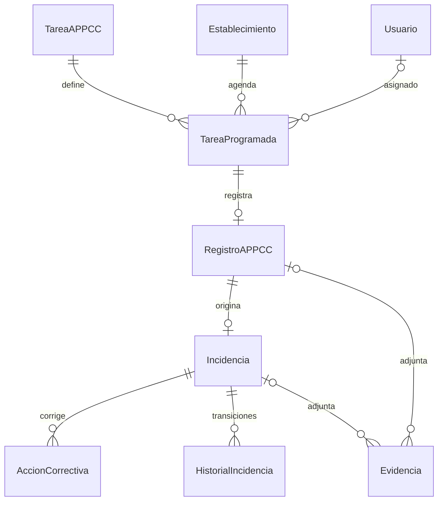

# Modelo MVP APPCC

El flujo de [usuarios y onboarding](usuarios-onboarding.md) añade invitaciones, configuración inicial de contraseña y gestión transaccional de membresías.

Las [consultas del frontend](consultas-mvp.md) documentan filtros, orden, paginación SQL y subrecursos de lectura del MVP `0.1.0-mvp`.

Modelo revisado sobre `main`, incluido el [ciclo operativo de tareas](ciclo-operativo-tareas.md) desde `29f4228`. Backend PHP 8.3,
Symfony 7.4, API Platform 4.3, Doctrine ORM 3.7/DBAL 4.4 y PostgreSQL **18.3**.
Se mantienen identificadores enteros y las migraciones anteriores; las ampliaciones
se incorporan mediante migraciones incrementales.

## Entidades y relaciones

Se conservan EntidadFiscal, Establecimiento, Usuario, UsuarioEstablecimiento,
PlanControl, PuntoControl, TareaAPPCC, RegistroAPPCC, Incidencia, AccionCorrectiva,
PlantillaAPPCC y las configuraciones fiscal y de establecimiento.
Se añaden TareaProgramada, Evidencia e HistorialIncidencia, con repositorios propios.



TareaAPPCC es una **definición recurrente**, con frecuencia, límites e instrucciones.
TareaProgramada representa una ejecución concreta. RegistroAPPCC referencia de forma
obligatoria y única la ejecución y conserva establecimiento y usuario.
La definición se obtiene mediante `getTarea()` de solo lectura.

`TareaProgramadaService::programar()` crea explícitamente una ocurrencia idempotente
por definición y fecha, con precisión de segundos. Un bloqueo sobre la definición y
UNIQUE protegen la concurrencia. `GeneradorTareasProgramadasService` materializa de
forma idempotente las frecuencias diaria, semanal y mensual mediante el comando
`app:tareas:generar`. Las fechas se calculan en la zona horaria de la entidad fiscal,
los límites mensuales inexistentes usan el último día válido y las ejecuciones se
crean sin usuario asignado. El servicio permite gestionar estados y detectar vencidas.
El comando `app:tareas:procesar` genera y detecta vencimientos con recuperación de ayer y hoy en cada zona fiscal. La API permite crear ejecuciones `BAJO_DEMANDA`, asignarlas y omitirlas con auditoría. La agenda filtra y pagina en SQL las ejecuciones pendientes/vencidas. Véanse [endpoints, cron, permisos y transiciones](ciclo-operativo-tareas.md).

Registrar un control bloquea la ejecución, valida plazo/pertenencia y calcula la
conformidad numérica/booleana. Registro, COMPLETADA, completadaAt, incidencia automática
e historial se confirman juntos. Las violaciones de unicidad se traducen a HTTP 409.
Los valores decimales siguen siendo strings NUMERIC(12,3); no se recalculan históricos.

Evidencia conserva metadatos y archivos locales privados, con exactamente un padre (registro o incidencia),
FK RESTRICT, tamaño positivo y SHA-256 calculado en servidor para las nuevas subidas. Symfony y CHECK PostgreSQL validan XOR.
La subida temporal se consume al crear el registro, aplicando foto obligatoria y confirmación auditable.
Véase [el flujo de evidencias y registros](evidencias-registros.md). HistorialIncidencia es de solo lectura por API; servicio y trigger PostgreSQL
impiden actualizar o borrar entradas. No se usan cascade remove ni orphanRemoval.

## Migraciones

El repositorio contiene actualmente diez migraciones:

1. `Version20260911130812`: crea `EntidadFiscal`.
2. `Version20260911132708`: crea el modelo APPCC inicial.
3. `Version20260911151914`: añade las configuraciones de entidad fiscal y establecimiento.
4. `Version20260912083224`: introduce `TareaProgramada`, `Evidencia` e `HistorialIncidencia`, migra `RegistroAPPCC` para referenciar una ejecución concreta y añade restricciones e índices.
5. `Version20260912084920`: añade autenticación a `Usuario` mediante los campos `password` y `roles`.
6. `Version20260912100000`: añade `diaSemana`, `diaMes` y `plazoMinutos` a `TareaAPPCC`, conservando valores nulos históricos.
7. `Version20260912110000`: añade versión optimista y restricciones de calendario en PostgreSQL, sin reescribir la migración anterior ni completar datos heredados arbitrariamente.
8. `Version20260913100000`: añade auditoría de omisión, CHECK de coherencia e índice de vencimiento por fecha límite, conservando omisiones históricas sin inventar datos.
9. `Version20260913205925`: añade invitaciones, tokens de configuración inicial de contraseña, normalización de emails y restricciones de integridad.
10. `Version20260916090000`: añade subidas temporales privadas, confirmación auditable y triggers de inmutabilidad para registros y evidencias.

La séptima migración crea CHECK de rangos, coherencia de frecuencia/días, plazo positivo y hora obligatoria/válida. Usa `NOT VALID` para conservar posibles definiciones heredadas inválidas, y valida cada restricción cuando todos los datos existentes la cumplen. Una restricción aún no validada protege igualmente las nuevas inserciones y actualizaciones. Tras configurar las tareas heredadas debe ejecutarse `ALTER TABLE tarea_appcc VALIDATE CONSTRAINT nombre_del_check`. El esquema Doctrine no sustituye esta comprobación de datos: consultar `pg_constraint.convalidated`.

La cuarta migración realiza un backfill de los registros existentes. Por cada `RegistroAPPCC` anterior crea una `TareaProgramada` completada conservando la definición de tarea, establecimiento, usuario, fecha y resultado.

Antes de eliminar la relación antigua comprueba que el backfill se haya realizado completamente. También bloquea la migración si existen duplicados históricos que requieran una decisión manual de conservación.

La relación entre `RegistroAPPCC` y `TareaProgramada` es única: una ejecución solo puede producir un registro. Igualmente, un registro solo puede originar una incidencia vinculada mediante la restricción `uniq_incidencia_registro`.

El historial de incidencias es append-only. La aplicación no permite modificarlo directamente y PostgreSQL dispone además de un trigger que impide `UPDATE` y `DELETE`.

Las migraciones están diseñadas específicamente para PostgreSQL. El estado real de cada entorno debe comprobarse antes de ejecutar cambios:

```powershell
php bin/console doctrine:migrations:status
php bin/console doctrine:migrations:list
```

No debe utilizarse `doctrine:schema:update --force` para sustituir las migraciones.

## Autenticación y aislamiento multiempresa

La API utiliza autenticación JWT mediante `LexikJWTAuthenticationBundle`.

El inicio de sesión se realiza mediante:

```text
POST /api/login_check
```

con correo electrónico y contraseña.

Todas las rutas `/api` requieren un usuario autenticado con `ROLE_USER`, salvo los POST de login, onboarding, aceptación de invitación y configuración inicial de contraseña. Véase el [contrato de usuarios](usuarios-onboarding.md).

Tras el login, [`GET /api/me`](contexto-sesion.md) descubre los establecimientos válidos del usuario solo con JWT, sin cabecera tenant. Las peticiones autenticadas a recursos de un establecimiento deben indicar además el establecimiento sobre el que trabaja el usuario:

```http
X-Establecimiento-Id: 123
```

El backend valida que:

* el usuario esté activo;
* el establecimiento exista y esté activo;
* la entidad fiscal asociada esté activa;
* exista una membresía activa entre el usuario y el establecimiento solicitado.

El identificador recibido en `X-Establecimiento-Id` no concede acceso por sí mismo.

`CurrentEstablecimientoContext` resuelve el establecimiento actual y su membresía. `TenantExtension` aplica el ámbito directamente sobre las consultas Doctrine para evitar que colecciones, elementos individuales e IRI puedan acceder a datos pertenecientes a otro establecimiento.

Las operaciones de escritura pasan además por `TenantAuthorization`.

Los roles empresariales se mantienen en `UsuarioEstablecimiento`:

* `ADMIN`
* `RESPONSABLE`
* `TRABAJADOR`
* `AUDITOR`

Los roles globales de Symfony almacenados en `Usuario.roles` se reservan para permisos generales de plataforma.

De forma general:

* `ADMIN` puede gestionar configuración y membresías.
* `RESPONSABLE` puede gestionar configuración operativa, tareas e incidencias.
* `TRABAJADOR` puede ejecutar controles, registrar incidencias y acciones correctivas, pero no modificar configuración.
* `AUDITOR` dispone de acceso de lectura.

El backend evita además que un usuario suplante a otro al registrar controles, incidencias, acciones correctivas o evidencias. El usuario responsable de la operación se obtiene del JWT autenticado.

## JWT

Las claves JWT no se versionan.

El entorno espera:

```dotenv
JWT_SECRET_KEY=%kernel.project_dir%/config/jwt/private.pem
JWT_PUBLIC_KEY=%kernel.project_dir%/config/jwt/public.pem
JWT_PASSPHRASE=
```

En una instalación nueva deben generarse las claves:

```powershell
php bin/console lexik:jwt:generate-keypair
```

Los archivos generados bajo `config/jwt/` están ignorados por Git.

## Pruebas

Las pruebas utilizan PHPUnit sobre una base PostgreSQL exclusiva de test.

La infraestructura de pruebas exige:

```text
APP_ENV=test
```

y una base cuyo nombre termine en `_test` y coincida exactamente con `APPCC_TEST_DATABASE`.

Esto evita que los tests destructivos puedan ejecutarse accidentalmente sobre la base de desarrollo.

Las pruebas cubren actualmente:

* entidades y relaciones;
* lógica de negocio;
* configuración;
* restricciones PostgreSQL;
* claves foráneas;
* índices;
* CHECK constraints;
* migraciones;
* backfill;
* rollback seguro;
* autenticación JWT;
* usuarios inactivos;
* selección de establecimiento;
* aislamiento entre tenants;
* permisos por rol;
* prevención de suplantación;
* CORS para el frontend.

Para ejecutar la validación:

```powershell
composer validate --strict
php bin/console lint:container

$env:APP_ENV='test'

php bin/console doctrine:migrations:migrate --no-interaction
php bin/console doctrine:schema:validate
php bin/phpunit
```

El workflow `.github/workflows/backend-ci.yml` ejecuta estas comprobaciones en GitHub Actions para cambios del backend.

## Funcionalidad pendiente

`GeneradorTareasProgramadasService` genera ejecuciones recurrentes diarias, semanales y mensuales dentro de una ventana limitada. Puede ejecutarse manualmente o desde cron:

```powershell
php bin/console app:tareas:generar
php bin/console app:tareas:generar --desde="2026-09-12" --hasta="2026-09-20"
```

Sin opciones utiliza ahora y los siete días siguientes. Las fechas `YYYY-MM-DD` representan días completos inclusivos en la zona fiscal de cada tarea. Con solo `--desde`, el final es ese día más siete días; con solo `--hasta`, el inicio es ese día menos siete días (ocho fechas inclusivas). Los instantes exigen `YYYY-MM-DDTHH:MM:SSZ` o desplazamiento `±HH:MM`, con extremos inclusivos. No se permite mezclar fechas sin hora con instantes. Fechas inexistentes, horas normalizadas y expresiones relativas se rechazan. Las tareas antiguas sin calendario completo se conservan, pero se ignoran y diagnostican hasta configurarlas.

Al modificar frecuencia, hora, día semanal, día mensual o plazo mediante `TareaAPPCCService`/PATCH, se retiran solamente ejecuciones de esa tarea y establecimiento con fecha estrictamente posterior a ahora, estado PENDIENTE y sin RegistroAPPCC. La retirada y el cambio se confirman en una transacción. No se modifican completadas, históricas, omitidas, vencidas ni ejecuciones con registro. La siguiente generación reconstruye la ventana solicitada con el nuevo calendario; debe incluirse el horizonte futuro deseado. Las nuevas ejecuciones no heredan asignaciones de las retiradas. Esta regla incluye pendientes futuras creadas manualmente, pues no hay distinción de origen.

Generación y edición bloquean primero la fila de la tarea. El generador recarga su configuración después del bloqueo y protege/revalida los padres activos y la zona fiscal. La reconciliación bloquea las ejecuciones candidatas y vuelve a consultar registros después de esperar. La versión optimista rechaza ediciones concurrentes obsoletas (HTTP 409); UNIQUE(tarea, fecha) sigue siendo la última defensa. Cada tarea generada es una transacción; ante un fallo posterior pueden haber quedado confirmadas tareas anteriores y se puede repetir la ventana con seguridad.

En cambios estacionales se genera una sola ocurrencia: una hora inexistente avanza por el salto horario y una repetida usa la primera aparición (PHP 8.3; pruebas para Europe/Madrid). El plazo suma minutos transcurridos en UTC. No se generan instantes anteriores a `createdAt`.

La revisión, las pruebas y los límites operativos se describen en [revision-generacion-recurrente.md](revision-generacion-recurrente.md).

No hay todavía un proceso persistente, Messenger ni scheduler integrado. `POR_TURNO` y `POR_RECEPCION` quedan pendientes por requerir, respectivamente, un modelo explícito de turnos y un flujo event-driven. `BAJO_DEMANDA` es manual por diseño.

El [almacenamiento privado de evidencias](evidencias-registros.md) incluye MIME/tamaño/hash verificados, tokens de un solo consumo, foto obligatoria y confirmación del usuario dentro del registro, descarga protegida, limpieza y verificación. Se requiere volumen persistente; no se implementa almacenamiento de objetos externo.

También permanecen pendientes:

* notificaciones;
* resumen diario;
* retención automática de registros;
