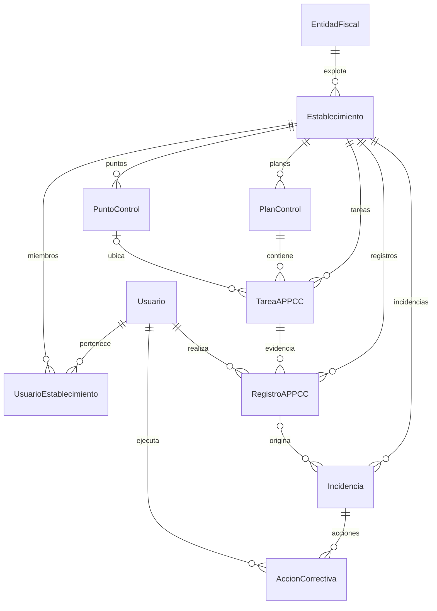

# Modelo MVP APPCC

Implementación adaptada a PHP 8.3.11 (el proyecto requiere >= 8.2), Symfony 7.4.18,
Doctrine ORM 3.7.0, DBAL 4.4.4, API Platform 4.3.18 y PostgreSQL 18.
No se han añadido dependencias.

## Entidades, tablas y API

Cada entidad utiliza atributos Doctrine, validación Symfony y un repositorio estándar
en `src/Repository`. Los nombres de tabla se generan con la estrategia del proyecto.

| Entidad | Tabla PostgreSQL | Ruta de colección |
| --- | --- | --- |
| EntidadFiscal (existente) | `entidad_fiscal` | `/api/entidades-fiscales` |
| Establecimiento | `establecimiento` | `/api/establecimientos` |
| Usuario | `usuario` | `/api/usuarios` |
| UsuarioEstablecimiento | `usuario_establecimiento` | `/api/usuarios-establecimientos` |
| PlanControl | `plan_control` | `/api/planes-control` |
| PuntoControl | `punto_control` | `/api/puntos-control` |
| TareaAPPCC | `tarea_appcc` | `/api/tareas` |
| RegistroAPPCC | `registro_appcc` | `/api/registros` |
| Incidencia | `incidencia` | `/api/incidencias` |
| AccionCorrectiva | `accion_correctiva` | `/api/acciones-correctivas` |
| PlantillaAPPCC | `plantilla_appcc` | `/api/plantillas-appcc` |

Las rutas de colección admiten GET y POST; las rutas `/{id}`, GET.
Los recursos nuevos admiten PATCH salvo `RegistroAPPCC` y `AccionCorrectiva`, que
permiten añadir y consultar evidencias. Los nuevos recursos no admiten DELETE:
las configuraciones se desactivan con `activo` o `activa`, y las incidencias se
gestionan mediante `estado`. Se mantienen las operaciones previas de EntidadFiscal.

PATCH utiliza `application/merge-patch+json`; POST admite `application/ld+json`.
Las relaciones ManyToOne se envían y reciben como IRI, por ejemplo
`"establecimiento": "/api/establecimientos/1"`. Las colecciones inversas están
disponibles en Doctrine pero no se leen ni escriben mediante los cuerpos JSON.
Esto evita ciclos y respuestas que contengan todo el histórico del establecimiento.
Se usan las [opciones de serialización de API Platform](https://api-platform.com/docs/v4.2/core/serialization/).

## Relaciones



Las 15 relaciones son bidireccionales, con Collection/ArrayCollection y métodos
para añadir, quitar y reasignar manteniendo ambos lados. Las relaciones obligatorias
tienen `JoinColumn(nullable: false)` y `NotNull`; pueden estar temporalmente sin
asignar mientras se construye un objeto. Quitar una relación obligatoria requiere
reasignarla antes de persistir.

PlantillaAPPCC es un catálogo independiente por TipoActividad. Su configuración es
una definición inicial; los datos reales permanecen en RegistroAPPCC. El modelo
permite enlazar incidencias con registros o crearlas manualmente. La aplicación de
plantillas y la creación automática de incidencias son flujos posteriores; no hay
automatismos que generen o modifiquen evidencias en esta implementación del modelo.

## Enums

Se conserva TipoEntidadFiscal. Se añaden en `src/Enum`:

- TipoActividad: restaurante, bar_cafeteria, carniceria, pescaderia, panaderia,
  pasteleria, obrador, hotel, catering, comercio_alimentario, otro.
- RolEstablecimiento: admin, responsable, trabajador, auditor.
- TipoPlanControl: temperaturas, limpieza, plagas, recepcion, trazabilidad,
  alergenos, agua, residuos, mantenimiento, aceite_fritura, otro.
- TipoPuntoControl: camara_frigorifica, congelador, almacen, cocina, recepcion,
  lavavajillas, equipo, zona, otro.
- FrecuenciaTarea: diaria, semanal, mensual, por_turno, por_recepcion, bajo_demanda.
- GravedadIncidencia: baja, media, alta, critica.
- EstadoIncidencia: abierta, en_proceso, resuelta.

Todos son backed enums string y se mapean con `enumType`, sin tipos ENUM nativos
específicos de PostgreSQL.

## Integridad y decisiones

- EntidadFiscal conserva todos sus campos y validaciones; solo se añade la relación
  con establecimientos. Su migración anterior permanece intacta.
- Usuario no implementa autenticación. Su correo se normaliza a minúsculas sin
  espacios exteriores, con restricción única y validación de duplicados.
- UsuarioEstablecimiento impone UNIQUE(usuario_id, establecimiento_id), además de
  validación Symfony. Los roles son datos; no hay autorización o aislamiento de
  lecturas por usuario en esta fase, que excluye login y seguridad de acceso.
- TareaAPPCC valida que su plan y punto correspondan a su establecimiento.
  RegistroAPPCC comprueba la tarea e Incidencia comprueba el registro asociado.
  Tampoco se puede trasladar un plan/punto con tareas de otro establecimiento ni
  una tarea con registros de otro establecimiento mediante la API.
- No se usa cascade remove ni orphanRemoval. Todas las FK usan ON DELETE RESTRICT.
  Desactivar configuraciones no elimina ni recalcula registros históricos.
- Los decimales usan NUMERIC(12,3) y strings en PHP/API: `"3.800"`. Se admiten hasta
  nueve cifras enteras y tres decimales. Se validan formato y orden mínimo/máximo.
- `horaPrevista` usa TIME_IMMUTABLE y formato API `HH:mm:ss`, por ejemplo `08:30:00`.
- createdAt se establece en el constructor. Los updatedAt de Establecimiento y
  PlanControl usan PreUpdate, como la EntidadFiscal existente. Ambos campos son de
  solo lectura por API. fechaHora y fechaApertura empiezan con la fecha actual y
  admiten indicar cuándo ocurrió el hecho. Todas las fechas usan DateTimeImmutable.
- `conforme` debe indicarse expresamente al registrar un control. Incidencia empieza
  ABIERTA; fechaCierre no puede preceder a fechaApertura.
- No se instalan módulos de autenticación, facturación, notificaciones ni otros
  módulos fuera del alcance. La estructura común sirve para todos los sectores.

## Migraciones y comprobaciones

Las dos migraciones se aplican en orden:

1. `Version20260911130812`: crea `entidad_fiscal` (ya existía, no modificada).
2. `Version20260911132708`: crea las diez tablas nuevas, índices y claves foráneas.

La segunda se generó con `make:migration` y se ajustó para no repetir la creación de
entidad_fiscal incluida en la primera, que aún estaba pendiente. Su reversión solo
afecta a las tablas nuevas. No se ha ejecutado ninguna migración en PostgreSQL.

Comprobaciones realizadas:

- Sintaxis PHP y `cache:clear` correctos.
- `doctrine:schema:validate`: mapeo correcto; esquema pendiente de sincronizar hasta
  aplicar las migraciones.
- `debug:router`: los once recursos registrados.
- `tests/EntidadFiscalTest.php`: regresión del modelo fiscal existente.
- `tests/MvpModelTest.php`: 60 peticiones API y pruebas de relaciones, validaciones,
  JSON multisector, fechas, unicidad, FK y conservación de históricos en SQLite
  en memoria. Incluye respuestas de error intencionales; Symfony puede registrarlas
  en stderr aunque la prueba termine correctamente.
- `tests/MigrationPlanTest.php`: compara sin conexión el SQL acumulado de las dos
  migraciones con el esquema PostgreSQL generado por el mapeo actual. No ejecuta SQL.

Desde `backend`, se pueden repetir las pruebas sin modificar PostgreSQL:

```powershell
php tests/EntidadFiscalTest.php
php tests/MvpModelTest.php
php tests/MigrationPlanTest.php
```

Después de revisar ambas migraciones, aplicar manualmente:

```powershell
php bin/console doctrine:migrations:migrate
php bin/console doctrine:schema:validate
php bin/console cache:clear
```

No es necesario generar otra migración para estos cambios. Antes de aplicar las
existentes, la advertencia de migraciones pendientes y el esquema sin sincronizar
son resultados esperados. La ejecución del SQL real en PostgreSQL queda pendiente
de esa revisión manual; las pruebas de persistencia se han realizado en memoria.
