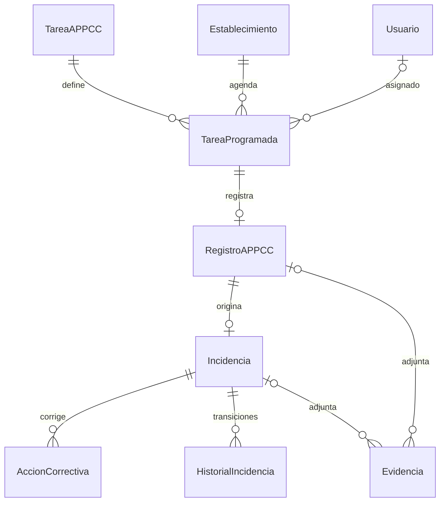

# Modelo MVP APPCC

Estado validado de fase 1, sobre `main` desde `3fee215`. Backend PHP 8.3,
Symfony 7.4, API Platform 4.3, Doctrine ORM 3.7/DBAL 4.4 y PostgreSQL **18.3**.
Se mantienen identificadores enteros y las tres migraciones existentes, que estaban
aplicadas en desarrollo. Las tablas operativas consultadas estaban vacías.

## Entidades y relaciones

Se conservan EntidadFiscal, Establecimiento, Usuario, UsuarioEstablecimiento,
PlanControl, PuntoControl, TareaAPPCC, RegistroAPPCC, Incidencia, AccionCorrectiva,
PlantillaAPPCC y las configuraciones fiscal y de establecimiento.
Se añaden TareaProgramada, Evidencia e HistorialIncidencia, con repositorios propios.



TareaAPPCC es una **definición recurrente**, con frecuencia, límites e instrucciones.
TareaProgramada representa una ejecución concreta. RegistroAPPCC referencia de forma
obligatoria y única la ejecución y conserva establecimiento y usuario.
La definición se obtiene mediante `getTarea()` de solo lectura.

`TareaProgramadaService::programar()` crea explícitamente una ocurrencia idempotente
por definición y fecha, con precisión de segundos. Un bloqueo sobre la definición y
UNIQUE protegen la concurrencia. No hay cron, Messenger ni generación automática,
tampoco para turnos, recepciones o demanda. El servicio permite gestionar estados y
detectar vencidas. La agenda consulta ocurrencias pendientes/vencidas hasta la fecha.

Registrar un control bloquea la ejecución, valida plazo/pertenencia y calcula la
conformidad numérica/booleana. Registro, COMPLETADA, completadaAt, incidencia automática
e historial se confirman juntos. Las violaciones de unicidad se traducen a HTTP 409.
Los valores decimales siguen siendo strings NUMERIC(12,3); no se recalculan históricos.

Evidencia guarda **solo metadatos**, con exactamente un padre (registro o incidencia),
FK RESTRICT, tamaño positivo y SHA-256 opcional. Symfony y CHECK PostgreSQL validan XOR.
No hay subida, lectura de archivos, S3 ni garantía atómica de `requiereFotoNoConforme`
o firma. HistorialIncidencia es de solo lectura por API; servicio y trigger PostgreSQL
impiden actualizar o borrar entradas. No se usan cascade remove ni orphanRemoval.

## Migraciones

1. `Version20260911130812`: entidad fiscal.
2. `Version20260911132708`: modelo inicial.
3. `Version20260911151914`: configuraciones.
4. `Version20260912083224`: ejecuciones, backfill, evidencias, historial e índices.

La cuarta se generó con Doctrine y se revisó manualmente: no basta con renombrar la
FK antigua. Inserta una ejecución completada por registro, con fechaHora como fecha
programada/finalización, y conserva usuario, establecimiento, definición y resultado.
Asigna la nueva FK y verifica el backfill antes de NOT NULL y de retirar la columna.
Duplicados históricos de definición/fecha o incidencia/registro bloquean toda la
migración sin borrar ni fusionar datos. Requieren una decisión explícita de conservación.
Para incidencias antiguas solo se guarda una instantánea identificada como migración;
no se inventan autores ni transiciones pasadas. `down()` solo procede sin nuevos datos.

La base de desarrollo se conserva sin aplicar la cuarta migración. La base exclusiva
de pruebas sí recibe todas las migraciones. `doctrine:schema:validate` en desarrollo
indica esquema pendiente; en pruebas pasa. No se ha usado schema:update --force.

## Pruebas

Los cinco scripts anteriores se han convertido a PHPUnit sobre PostgreSQL. Se añadieron
PHPUnit, BrowserKit y CssSelector mediante symfony/test-pack (Flex desempaqueta el pack).
Se prueban servicios, configuración, entidades, restricciones reales, rollback,
índices, migración desde vacío, down/reaplicación y backfill con datos.
No quedan scripts antiguos pendientes de ejecución y no se usa SQLite.

```powershell
composer validate --strict
php bin/console lint:container
$env:APP_ENV='test'
php bin/console doctrine:migrations:migrate --no-interaction
php bin/console doctrine:schema:validate
php bin/phpunit
```

La infraestructura exige APP_ENV=test, PostgreSQL, nombre terminado en `_test` y
coincidencia exacta con `APPCC_TEST_DATABASE`. Las limpiezas usan TRUNCATE solo tras
validar esas condiciones. Nunca ejecutan database:drop ni imprimen la URL.

## Seguridad pendiente de fase 2

JWT, selección de establecimiento y permisos todavía no están implementados en esta
fase. La siguiente fase queda condicionada a superar todas las comprobaciones anteriores.